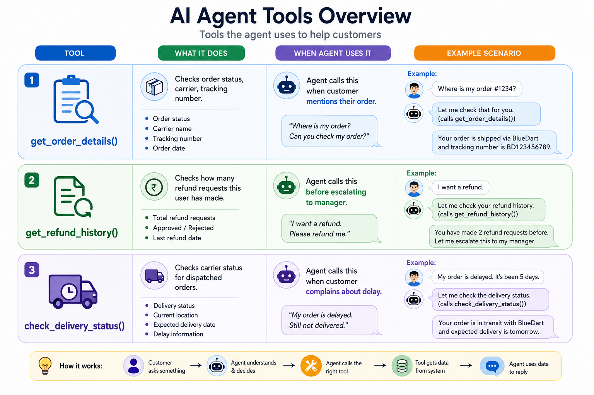

# 🌪️  AI — Autonomous Customer Support System


An enterprise-grade, multi-agent AI customer support platform built from first principles for **CoolBreeze AC**. 

Instead of relying solely on high-level frameworks like LangChain, this system implements the **agent loop, custom tool-calling, and multi-agent orchestration directly in pure Python**, backed by Django ORM models and real-time streaming interfaces.

> 🛠️ **Status:** Active development. Django and MySQL are configured. Product, order, and refund request models are implemented, migrations have been applied, and sample data has been loaded. Agent workflows, document retrieval, and the live support dashboard are planned.

---

## 📸 Screenshots & Overview

### AI Agent Tools Overview



---

## 🎯 Project Goals

- **Autonomous Customer Support:** Build agents capable of retrieving business information and executing controlled database actions.
- **ORM Tool Integration:** Connect AI tool calls directly to application data through the Django ORM.
- **Multi-Agent Orchestration:** Coordinate tier-1 support, management, and risk assessment workflows autonomously.
- **Zero-Hallucination RAG:** Ground model responses strictly in official company documents and policies.
- **Real-Time Visibility:** Make all agent loops and tool calls visible to staff through a live streaming dashboard.
- **Cloud Deployment:** Deploy the application using environment-based configuration on Railway.

---

## 🤖 Multi-Agent Architecture

The application coordinates three specialized autonomous agents that work together to resolve complex customer inquiries, inspect database states, and evaluate refunds safely.

| Agent | Role | Planned Responsibilities |
| :--- | :--- | :--- |
| **AURA** | **L1 Customer Support** | First point of contact. Answers product, delivery, and policy questions. Retrieves order info via tools, checks delivery status, and escalates out-of-scope issues. |
| **Manager Agent** | **Escalation & Approvals** | Reviews cases escalated by AURA. Consults policies, requests risk assessments, decides refund eligibility within defined permissions, and logs explanations. |
| **Risk Agent** | **Fraud Assessment** | Reviews order and customer history for suspicious patterns. Returns structured risk scores to assist the Manager Agent (does not constitute proof of fraud). |

---

## ⚡ Core AI Infrastructure

### 📚 Document Retrieval (RAG)
A Retrieval-Augmented Generation pipeline provides agents with grounded context from official documents (e.g., refund policies, delivery procedures, product manuals):
- Extract text from PDF documents using `pypdf`.
- Split text into searchable sections and generate embeddings.
- Store and query vectors using **ChromaDB**.
- Inject relevant context directly into the model prompt to eliminate hallucination. Missing or conflicting data triggers agent uncertainty or escalation.

### 📊 Live Support Dashboard
A staff-facing monitoring dashboard built using **Server-Sent Events (SSE)** to display:
- Incoming customer conversations in real time.
- Agent tool calls and execution results.
- Handoffs and task transfers between agents.
- Operational events, case status changes, and decision summaries.

---

## 🛠️ Technology Stack

| Technology | Role | Status |
| :--- | :--- | :--- |
| **Python** | Backend & agent execution logic | 🟢 In use |
| **Django** | Application framework & ORM | 🟢 In use |
| **MySQL** | Relational database storage | 🟢 Configured |
| **PyMySQL** | MySQL database driver | 🟢 Configured |
| **python-decouple** | Environment-based secret management | 🟢 In use |
| **Anthropic API** | Language model & tool-calling engine | 🟡 Planned |
| **ChromaDB** | Vector database for document retrieval | 🟡 Planned |
| **pypdf** | PDF text extraction for RAG | 🟡 Planned |
| **Django Templates / JS** | Application user interface | 🟡 Planned |
| **Server-Sent Events** | Live agent activity streaming | 🟡 Planned |
| **Railway** | Production cloud deployment platform | 🟡 Planned |

---

## 📁 Project Structure

```text
dj_ai_employee_main/   # Project settings, URL routing, and application entry points
orders/                 # Product, order, and refund models, admin config, and migrations
docs/                   # Visual assets, diagrams, and documentation
manage.py               # Django CLI management executable
requirements.txt        # Production Python dependencies
.env                    # Private local configuration (excluded from Git)
.gitignore              # Git exclusion rules
README.md               # Project documentation
```
🚀 Local Setup Guide
Prerequisites
Python compatible with Django version in requirements.txt.

Running MySQL server and a user account with database creation privileges.

Git.

An Anthropic API key (required once LLM integration is activated).

1. Get the Project & Virtual Environment
Bash
# Clone the repository and navigate to root directory
git clone [https://github.com/atinos31/dj_ai_employee_main.git](https://github.com/atinos31/dj_ai_employee_main.git)
cd ai-support-agents

# On macOS/Linux:
python3 -m venv env
source env/bin/activate

# On Windows PowerShell:
py -m venv env
.\env\Scripts\Activate.ps1

# Install dependencies
python -m pip install -r requirements.txt
2. Create the MySQL Database
Log into MySQL via CLI or workbench:

SQL
CREATE DATABASE IF NOT EXISTS ai_employee_db CHARACTER SET utf8mb4;
EXIT;
3. Configure Environment Variables
Create a .env file adjacent to manage.py:

Extrait de code
SECRET_KEY=replace_with_a_generated_secret_key
DB_NAME=ai_employee_db
DB_USER=your_mysql_username
DB_PASSWORD=your_mysql_password
DB_HOST=localhost
DB_PORT=3306
ANTHROPIC_API_KEY=your_claude_api_key
Tip: Generate a secret key locally: python -c "import secrets; print(secrets.token_urlsafe(64))"

4. Apply Migrations & Start Server
Bash
python manage.py check
python manage.py migrate
python manage.py createsuperuser  # Optional
python manage.py runserver
Application URL: http://127.0.0.1:8000/

Django Admin: http://127.0.0.1:8000/admin/

🗺️ Engineering Roadmap
[x] Initialise the Django project.

[x] Configure MySQL connectivity using PyMySQL.

[x] Introduce environment-based secret configuration.

[x] Build product, order, and refund request models.

[x] Apply initial migrations and load sample seed data.

[ ] Create the customer support interface.

[ ] Implement business data tools using the Django ORM.

[ ] Integrate Anthropic Claude API.

[ ] Build AURA’s core agent loop.

[ ] Implement Manager and Risk agent coordination.

[ ] Add document ingestion and ChromaDB vector retrieval.

[ ] Stream real-time activity to staff dashboard via SSE.

[ ] Implement security safeguards, permissions, and iteration limits.

[ ] Deploy to Railway.

🔒 Security & Operational Safeguards
Before production deployment, the platform implements the following security boundaries:

Credential Protection: Environment-isolated keys and production-hardened Django settings.

RBAC & Auth: Granular staff authentication and strict tool-level access permissions for each agent.

Loop Safeguards: Strict iteration caps, execution timeouts, and API rate limiting.

Data Protection: Prompt injection defenses against untrusted documents and customer PII protection in logs.

💻 Developer Cheat Sheet
Bash
# Activate virtual environment (macOS/Linux)
source env/bin/activate

# Run local development server
python manage.py runserver

# Run system integrity check
python manage.py check

# Database migrations
python manage.py makemigrations
python manage.py migrate

# Access database shell & create superuser
python manage.py dbshell
python manage.py createsuperuser

# Execute test suite
python manage.py test
Extensions:

Python & Pylance (Microsoft) — Intellisense and type checking.

Ruff (Astral) — High-performance formatting and linting.

Django (Baptiste Darthenay) — Template syntax highlighting.

Configuration:

Open Command Palette (Cmd + Shift + P).

Run Python: Select Interpreter -> Select ./env/bin/python.

Set Ruff as default formatter and enable Editor: Format On Save.

Bash
# Check status and diff
git status
git diff

# Stage and commit intentional updates
git add README.md
git commit -m "docs: update comprehensive project guide"

# Push to remote branch
git push

DEVELOPER NOTES
### ⚡ Django terminal shortcut

I use a simple zsh alias to shorten Django commands:

```bash
alias pym="python manage.py"

Add it to:

~/.zshrc

Then reload your shell:

source ~/.zshrc

Now instead of:

python manage.py runserver

I can use:

pym runserver

And the same works for:

pym migrate
pym makemigrations
pym shell
pym dbshell
👩‍💻 Author: Sandra Atino — Python & Django Developer building AI-powered systems.